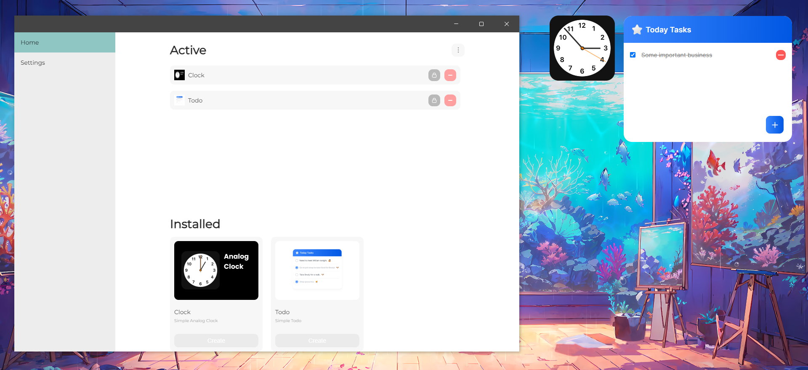

<br />
<div align="center">
    
    <p>WebWidgets</p>
</div>
<p align="center">
    <b>Widgets for your desktop</b>
</p>

Hello world, today you came across the Web Widgets project, which is a unique platform for creating desktop widgets using web technologies. Unfortunately, a lot is not ready now because I am implementing the project alone, but I, as the author of this project, guarantee that I will improve the applications a hundred times more.



## Available for

- Windows
- Linux support will be implemented in v.0.1.0

## How do I create my own widget?

First, you need to create a widget folder. Then we create an index.json is a widget configuration file, we create the following structure in it and fill in the fields with our data

```
{
    "name": "Clock",
    "description": "Simple Analog Clock",
    "author": "Vladislav Kori",
    "preview": "/assets/preview.png",
    "window": {
        "width": "155",
        "height": "155",
        "entryFile": "/index.html"
    }
}
```

The input file is index.html It is recommended to create it in the root of the project. Congratulations, you have created your widget. Open the application and check if your widget is in the list of installed ones. If the widget does not appear, then restart the application. At the moment, the application can only be disabled via Tray (the icon in the windows toolbar next to the language change).

## Features

The platform allows you to use node js libraries on the client

- os
- path
- fs

Restrictions have been introduced due to security reasons

The platform supports two languages:

- Russian
- English

## How to develop?

You need to open the app. Create a widget, i.e. make it appear on your screen. Then go to settings and turn on dev mode. Your widget window will expand to the full screen, and chrome dev tools will also open. Unfortunately, hot reload and typescript support are not implemented now, but this will be implemented in future versions

## Contact

[Telegram](https://t.me/gjoygo)<br/>
My Maill - vladislav.kori@yandex.ru<br/>
